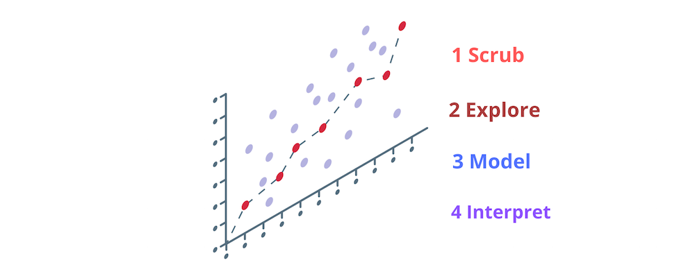

#Perform regression analysis on the subset of KC Housing Data in order to find a positive linear relationship between house price and feature values

## Project Files
Main Module: student.ipynb
Data: kc_house_data.csv

## Linear Regression Model Process Overview

Cohort: Data Science Created by: Sue Mir Date: 17/October/2019
